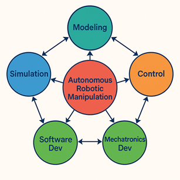

# Overview of the ARM4L Research Lab

The **ARM4L Research Lab** at King Fahd University of Petroleum and Minerals **(KFUPM)** is part of the Interdisciplinary Research Center for Smart Mobility and Logistics **(IRC-SML)** dedicated to advancing research in **Autonomous Robotic Manipulation for Logistics**. Our focus is on developing **robotic manipulators** capable of operating in constrained environments with high precision and can collaborate with other robots and humans to solve real-world problems related to Automation of Logistics. Our research addresses both the theoretical aspect of robotic manipulation, including dynamic modeling and control system design, as well as practical aspects, including hardware and software integration and real-world testing.

## Research Areas 📌 
Our research covers a wide range of topics, including but not limited to:  

- **Theoretical research** 
  - Geometric Port-Hamiltonian modeling of floating-base manipulators (FMs)
  - Geometric Control of FMs
  - Energy-based Control of FMs
  - Multi-FM Interaction Control

- **Computational research** 
  - Software-in-the-loop (SITL) / Hardware-in-the-loop (HITL) Simulation Environments
  - Parameter and State Estimation of FMs
  - Structure-preserving Discretization of FM dynamics.

- **Experimental research** 
  - Mechatronics Design of ARMs
  - Multi-aerial robot collaborative manipulation
  - Power-electronics Design of Tethered-ARMs
  - ARM for Logistics, Maintenance, and Agriculture Applications

## Objectives  🎯 
- Advance the theoretical foundations of **autonomous robotic manipulation**, with emphasis on geometric modeling, control, and energy-based approaches.  
- Develop **computational frameworks** for accurate simulation, estimation, and structure-preserving discretization of robotic dynamics.  
- Design and integrate **experimental platforms**, combining mechatronics, power electronics, and real-world validation of robotic manipulators.  
- Enable **collaborative manipulation** among multiple aerial and ground robots, as well as safe and efficient interaction with humans.  
- Translate fundamental research into **real-world applications**, particularly in agriculture, logistics, and other constrained environments.  

## Collaboration & Contributions 🤝  
The **ARM4L Research Lab** welcomes collaboration with students, faculty, and external researchers. Contributors are encouraged to document their progress, share insights, and maintain an updated documentation of their work in the [ARM Wiki](https://github.com/kfupm-arm-lab/arm-wiki).
For more information about the IRC-SML visit their [website](https://ri.kfupm.edu.sa/irc-sml).

Contact Ramy Rashad **(ramy.rashad (at) kfupm.edu.sa)** to get access to our Github Repositories.

For details on setting up a Developer Environment (Toolchain), visit the **Toolchain Installation** Page in the Wiki.  

🚀 *Join us as we push the boundaries of robotics research and innovation!*  
